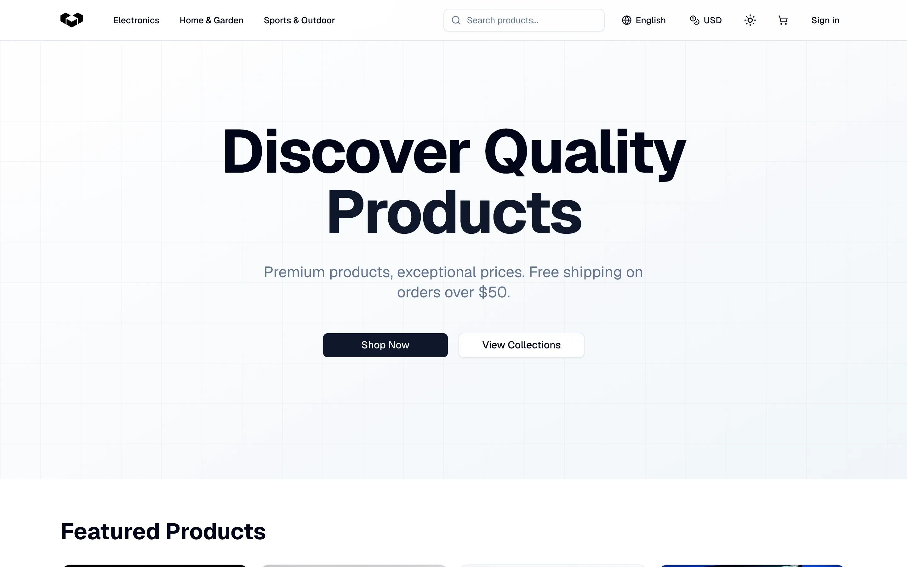
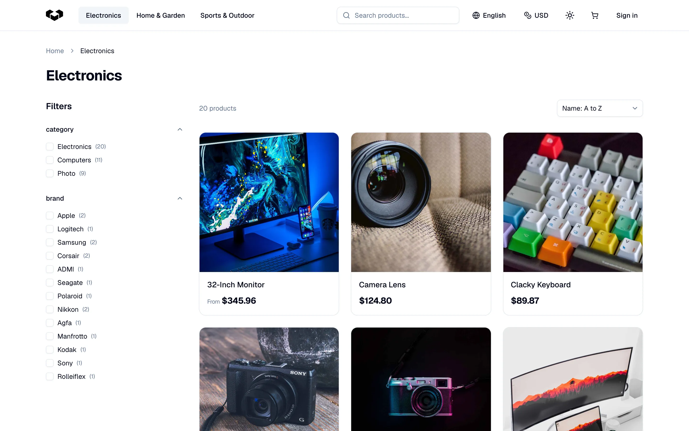
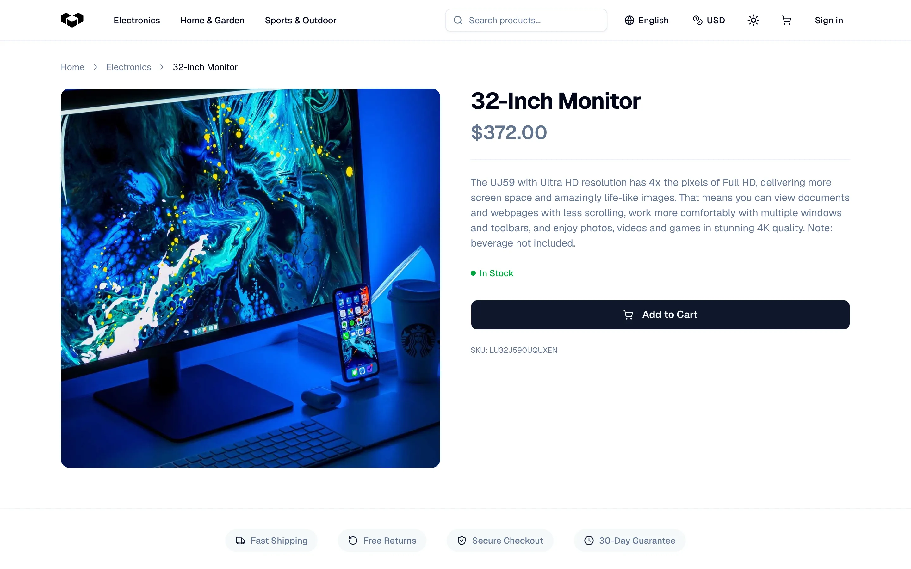

Vendure officially supports storefront starters for **TanStack Start** and **Next.js**. Both provide a production-ready foundation that you can customize for your store.

Both starters use the same storefront design, shown here running with TanStack Start.

New Vendure projects created with `@vendure/create` can include either starter. The tool configures the storefront and Vendure server together in a monorepo.

## TanStack Start Storefront Starter

The TanStack Start Storefront Starter uses TanStack Router, Vite, and Paraglide. It is organized into feature modules with clear dependency boundaries, and includes a managed workflow for adopting upstream starter releases without overwriting your customizations.

It includes:

- Product listings, details, search, facets, and sorting
- Cart and checkout flows
- Customer accounts, addresses, and order history
- Multi-language and multi-currency support
- Cache revalidation
- A managed upgrade workflow

- 🔗 [tanstack.vendure.io](https://tanstack.vendure.io/)
- 💻 [github.com/vendurehq/tanstack-starter-vendure](https://github.com/vendurehq/tanstack-starter-vendure)

## Next.js Storefront Starter

The Next.js Storefront Starter uses the App Router, next-intl, and Tailwind CSS.

It includes:

- Product listing
- Product details
- Search with facets
- Cart functionality
- Checkout flow
- Account management
- Styling with Tailwind

- 🔗 [next.vendure.io](https://next.vendure.io/)
- 💻 [github.com/vendurehq/storefront-nextjs-starter](https://github.com/vendurehq/nextjs-starter-vendure)

:::note
Prefer to build your own solution? Follow the rest of the guides in this section to learn how to build a Storefront from scratch.
:::
